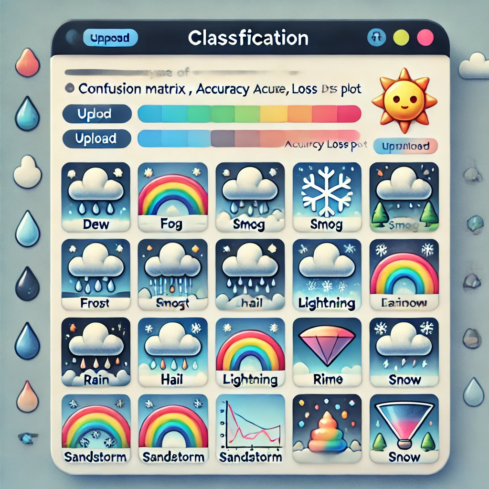

# 🌤️ Weather Image Classification App

This application classifies images into **11 weather types** using advanced deep learning models. It is designed for ease of use, with detailed visualizations of model performance and a user-friendly interface deployed on Render.



---

## 🌈 Weather Types Classified

The app supports the following weather conditions:

1. **Dew**
2. **Fog/Smog**
3. **Frost**
4. **Glaze**
5. **Hail**
6. **Lightning**
7. **Rain**
8. **Rainbow**
9. **Rime**
10. **Sandstorm**
11. **Snow**

---

## 🧠 Models Implemented

The app leverages multiple state-of-the-art deep learning models for classification:

- **EfficientNetB7**
- **ResNet50**
- **ResNet152V2**
- **MobileNet**
- **VGG19**
- **VGG16**
- **InceptionResNetV2**
- **Xception**
- **ResNet101**
- **DenseNet201**

Each model's performance is evaluated and visualized for better understanding and comparison.

---

## 🛠️ Features and Functionality

### 🔍 **Model Performance Visualization**

- **Accuracy & Loss Plots**: Track model training progress.
- **Confusion Matrix with Heatmap**: Visual representation of predictions.
- **Classification Report**: Precision, recall, and F1-score metrics for each weather type.
- **Prediction Visualizations**: See model predictions alongside input images.

*All these visualizations are stored in:*
- `artifacts/visualize_model_training_results`

---

### 📊 **Test Data Evaluation Results**

- Evaluated scores for each model are saved in:  
  - `artifacts/evaluate_scores`

---

### 🔄 **Development Stages**

The project follows a modular pipeline structure for scalability and maintainability:

1. **Data Ingestion**: Fetch and preprocess the dataset.
2. **Data Transformation**: Reduce the dataset size for faster experimentation while preserving diversity.
3. **Data Splitting**: Split data into training and testing sets.
4. **Model Training**: Train deep learning models on the processed data.
5. **Model Evaluation**: Evaluate each model's performance using test data.

Each stage is encapsulated in separate files for better modularity and reusability.

---

### ⚙️ **Configuration with `config.yaml`**

The app uses a `config.yaml` file to store all configurable parameters, ensuring flexibility and ease of updates without modifying the code.  

#### Example Configurations in `config.yaml`:
- Dataset paths
- Model-specific parameters
- Training and evaluation parameters
- Paths for saving results and logs

The pipeline dynamically reads from `config.yaml`, making it easy to customize settings for different runs.

---

## 🚀 App Deployment

The app is built using **Streamlit** and is deployed on **Render** for public access.
 [Weather-Image-Classification-App](https://weather-image-classification.onrender.com).

### 🌟 Features of the App:
- Upload images for classification.
- View model performance metrics.
- Compare results from different models.
- Visualize predictions interactively.

---

## 📝 How to Use

1. **Clone the Repository**:
   ```bash
   git clone <repository_url>
   cd weather-image-classification-app
   ```
2. **Install Dependencies**:
   ```bash
   pip install -r requirements.txt
   ```
3. **Run the App**
   ```bash
   streamlit run app.py
   ```
## 📌 Key Considerations
- **Dataset**: The original dataset is large, so a subset is used to maintain efficiency during training and testing.
- **Visualization**: Comprehensive tools are provided to analyze and compare model performance.
- **Scalability**: The modular structure and config.yaml make it easy to add or modify components.

